<picture><source media="(prefers-color-scheme: dark)" srcset="./assets/operator-dark.svg"></picture>
<picture><source media="(prefers-color-scheme: dark)" srcset="./assets/spec-dark.svg"></picture>

<samp>the systems behind my own ventures, then plugged into partners' businesses.</samp>

<samp>about me</samp>

 

Business economics & IT student in Denmark, and growth engineer at **Holmgaard Co.**, a small development studio in Copenhagen.

I like building things that solve problems I actually have. It usually starts small: something repetitive, something hard to keep track of, a tool that almost does what I need. I build a fix, use it, find where it falls short, and keep going until it is genuinely useful.

That habit has taken me a long way down the stack. An automation turns into an application, the application needs somewhere to run, and running it raises questions about networking, storage, security and monitoring. So I learned the layers underneath what I set out to build. That is how a business student ends up running a Kubernetes cluster.

<samp>growth engineering & bootstrapping</samp>

 

**Growth engineering**, the way I do it, is building the systems a business grows on (SEO, lead generation, automation, data and measurement) and treating them as software: versioned, tested, measured, improved.

At Holmgaard we build those systems for our own ventures first. Only what proves itself there gets connected to a partner's workflow: their website, their CRM, the whole chain from a search to a closed order.

**Bootstrapping** is the other half. With nobody else to fill the gaps, you move between development, infrastructure, data, operations and the business problem whenever the project needs it. It also keeps you honest about cost: hardware we own costs the same whether an automation runs ten times a month or ten thousand.

<samp>how i work</samp>

 

**Start with the outcome.** Define what "better" means before building. A feature only matters if it changes the outcome.

**Keep the loop short.** Get a small version into real use, learn from it, iterate. The first version is rarely the interesting one.

**Right tool, right job.** Go for infrastructure, backends and micro-services. Python for tests and prototypes. Next.js for the web, and WordPress when a client needs it.

**Make work visible.** Branches, previews and boards, so it is clear what is real and what is finished.

**Make mistakes cheap.** Everything in git, everything reproducible, snapshots before experiments, agents in their own sandbox.

**Understand the layer underneath.** I don't reinvent everything, but I want to know what my abstractions are doing.

<samp>why it's built like this</samp>

 

**Own hardware.** A subscription that charges per seat or per run gets more expensive exactly when something starts working. Hardware we own doesn't. And operating it teaches what reading about it doesn't: restoring a backup, chasing why a node won't join, watching a disk fill.

**Go for infrastructure.** A single static binary with no runtime to install is the right shape for things that have to just run. Drop it in, start it, done.

**GitOps.** A cluster defined in git can be read, diffed and recreated; one defined by clicks can't. Argo CD keeps the cluster equal to the repo, so a rollback is a revert.

**A preview per branch.** Every change is something you can click before it merges, not something you hope works after.

**Agents in a box.** An agent gets its own VM and exactly the tools it needs, through an allowlist. It can read; it can't publish.

 

<samp>§1 &nbsp;what it runs on</samp>

<picture><source media="(prefers-color-scheme: dark)" srcset="./assets/homelab-dark.svg"></picture>
<picture><source media="(prefers-color-scheme: dark)" srcset="./assets/cluster-dark.svg"></picture>
<picture><source media="(prefers-color-scheme: dark)" srcset="./assets/previews-dark.svg"></picture>
<picture><source media="(prefers-color-scheme: dark)" srcset="./assets/agents-dark.svg"></picture>
<picture><source media="(prefers-color-scheme: dark)" srcset="./assets/services-dark.svg"></picture>
<picture><source media="(prefers-color-scheme: dark)" srcset="./assets/stack-dark.svg"></picture>

<samp>spec sheet</samp>

 

| layer | |
|---|---|
| metal | 3 × Proxmox VE: `pve` · `dell` · `m920q`, 128 GB, 30 threads |
| guests | LXC for services that sit still, VMs for projects, templates for Go services |
| iac | OpenTofu with `bpg/proxmox` and `siderolabs/talos`; a scoped sandbox pool, ≤ 2 cores and ≤ 2 GB a guest |
| cluster | Talos Linux, 1 control plane, 2 workers |
| gitops | Argo CD app-of-apps, managing itself · Sealed Secrets |
| edge | MetalLB · Traefik · cert-manager on a private CA |
| previews | ApplicationSet → app + database per branch, own Helm chart, new commits pulled every 60 s |
| languages | Go for infra, backends, micro-services · Python for tests, prototypes · Next.js for the web |
| network | Tailscale mesh · ufw, default deny |
| ci | self-hosted GitHub Actions runner |
| agents | Claude Code on a control VM · Hermes on its own VM, through an MCP allowlist, read-only |
| next | second control plane · Velero → NAS · kube-prometheus-stack · PR previews for apps |

 

<samp>§2 &nbsp;how it gets built</samp>

<picture><source media="(prefers-color-scheme: dark)" srcset="./assets/method-dark.svg"></picture>

 

<samp>every figure is drawn by <a href="./scripts/make_profile.py">scripts/make_profile.py</a> · isometric line art, animated in css</samp>

