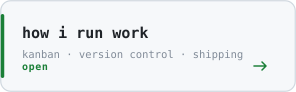

<!-- EDIT ME: your real links, or delete the line -->
<!-- [site](https://example.com) &nbsp;·&nbsp; [linkedin](https://www.linkedin.com/in/you/) &nbsp;·&nbsp; [email](mailto:you@example.com) -->

> Business Economics & IT student in Denmark. Bootstrapper — marketing and IT.

Bootstrapping means no budget to hide behind, so I learn the whole stack
rather than the part that fits a job title: the campaign and the funnel it
runs on, the automation and the hypervisor it runs on. The economics half of
the degree is why I care what a thing costs to keep running, not just whether
it works on the day it ships.

Mostly that looks like small automations that remove a manual step, sites that
load fast, and a homelab I run properly instead of leaving it to rot.

 

**Two ways through this page — pick whichever you came for.**

Bootstrapping without a team means the process has to survive me forgetting
things. A board is the cheapest way to do that: work is visible, and the column
a card sits in is the honest answer to "what state is this actually in", which
is not the same as how busy I feel.

The column I care about is **doing**, and the rule is that it stays small.
Three things half-finished is worse than one thing shipped, because unfinished
work has a holding cost — you pay to remember it every time you look at the
board. Limiting what is in flight is not discipline for its own sake, it is
what makes the rest of the columns tell the truth.

Same idea in version control. Work happens on a branch, `main` stays something
I could deploy right now, and a change gets read before it lands — even when
the person reading it is me a day later. Reviewing my own branch has caught
more than it has any right to; writing down what a change does forces me to
notice when I cannot explain it.

<b>&nbsp;How I keep a project honest when nobody is checking</b>

 

**Write the finish line first.** Before starting I write what "done" means in
one sentence. If I cannot, the task is really two tasks wearing a coat, and
splitting it there saves the argument with myself later.

**Small commits, real messages.** A commit that says `fix stuff` is a note to
nobody. The one that says why the change was needed is the note I will actually
want in six months, when the code makes sense but the reason does not.

**Timebox the research.** It is easy to spend an evening reading about the
correct approach and ship nothing. I give unknowns a fixed slot; when it runs
out I take the best option I have and write down what I would revisit.

**Stop counting hours, count shipped things.** The economics half of my degree
made this concrete: effort is a cost, not an output. What matters is whether
the manual step is actually gone.

<!-- EDIT ME: swap in your real tools — Jira/Linear/GitHub Projects, whatever
     you use — and the way your board is really laid out. -->

Everything self-hosted runs on **Proxmox VE** — one hypervisor, guests split by
job rather than piled into one box, so a broken container is a broken container
and not a broken evening. Storage is **ZFS**, which is the actual reason the
setup is worth running: snapshots make a bad change cheap to undo, and
scrubbing means bit rot gets caught rather than quietly restored from a backup
that already has it.

The rule I hold it to is that a rebuild has to be boring. Configuration lives
in files, backups run without being asked, and nothing important exists in only
one place. Running it is how I learn infrastructure — you find out what you
actually understand the first time you have to restore something.

<!-- EDIT ME: the tiles in infra.svg are set in scripts/make_profile.py
     (the SERVICES list). Swap them for what you really run, then re-run
     `python3 scripts/make_profile.py`. -->

<b>&nbsp;The guest split — a VM to break, containers to keep up</b>

 

The split is not about tidiness, it is about what a mistake costs.

**Dev lives in a VM.** It has its own kernel, so I can install anything, load
modules, and change things that a container is not allowed to touch. It is the
box I am allowed to break, and a snapshot before an experiment means breaking
it costs a rollback instead of an evening.

**Services live in LXC containers.** They share the host kernel, so they boot in
about a second and cost roughly what the process itself costs — no second kernel
sitting in RAM doing nothing. Running eight of them is realistic on one machine
in a way that eight VMs would not be.

The rule I use when adding something new: if it needs its own kernel, or I do
not trust it, it gets a VM. If it is a service I trust to sit still and do one
job, it gets a container.

<b>&nbsp;Storage and backups — why ZFS is the point</b>

 

**Snapshots make changes reversible.** Taking one before an upgrade turns "I
hope this works" into "I can undo this", which is the difference between
tinkering carefully and tinkering freely. They are cheap because they only
store what changed.

**Scrubbing catches bit rot.** ZFS checksums every block and verifies them on a
schedule, so silent corruption is found and repaired rather than sitting in a
file until the day I open it. Without that, a backup can faithfully preserve
data that is already broken.

**A snapshot is not a backup.** It lives on the same pool, so it does not
survive the pool dying. Anything I would be upset to lose exists somewhere the
server cannot reach on its own.

The honest test is restoring, not backing up. A backup nobody has restored is a
belief, not a backup.

<!-- EDIT ME: add your real snapshot/scrub/backup schedule here. -->

<b>&nbsp;Network and access — how I actually reach it</b>

 

I work on the server from **VS Code over SSH**, so the editor runs on my laptop
while everything it touches — the files, the language server, the terminal —
runs on the guest. The laptop stops being a machine I have to keep configured
and becomes a keyboard and a screen.

Keys, not passwords. The management interface is not something I expose to the
internet; reaching it from outside goes through a VPN rather than a port
forward. Anything that genuinely needs to be public sits behind a reverse proxy
that terminates TLS in one place, so certificates are one job instead of one job
per service.

<!-- EDIT ME: swap in your real firewall, VPN and reverse proxy choices. -->

<b>&nbsp;Why self-host any of this</b>

 

Bootstrapping is the short answer. A subscription that charges per seat or per
run gets more expensive exactly when something starts working, which is the
worst possible time to be punished for it. Hardware I already own costs the same
whether an automation runs ten times a month or ten thousand.

The longer answer is that operating something teaches what reading about it
does not. Restoring a backup, chasing why a container will not start, watching a
disk fill — those are the moments where you find out which parts you actually
understood. That is difficult to get from a tutorial and it is most of why the
lab exists.

The trade is real, though: I am also the person who gets paged. Self-hosting is
worth it for the things I want to understand and the things that would otherwise
meter me. Not for everything.

One machine underneath all of it. Dev work sits in a **VM** — its own kernel, so
I can break it without taking anything else down — and the services run as **LXC
containers**, which share the host kernel and cost almost nothing to leave
running. Splitting them that way is the whole point: the thing I experiment on
and the things that need to stay up are not the same thing.

I work on it from **VS Code over SSH**, which makes the laptop mostly a keyboard.
Nothing important lives locally, so a reinstall costs an afternoon rather than a
weekend.

<!-- EDIT ME: the tools and which lane each runs in are the TOOLS list in
     scripts/make_profile.py — tag a tool "vm" or "ct" and the funnel follows. -->

<b>&nbsp;Go, Terraform and MCP — the parts I write myself</b>

 

**Go, for the things that have to just run.** A single static binary with no
runtime to install is the right shape for a box I want to stay boring: drop it
in a container, point systemd at it, and it does not break because something
upgraded a dependency underneath it. It is also small enough in memory that
running several alongside everything else is not a decision I have to think
about.

**Terraform, so the lab is describable.** The point is not that clicking through
the Proxmox UI is slow — it is that clicking leaves no record. A guest defined
in code can be read, diffed and recreated; a guest defined by remembering what I
clicked eight months ago cannot. This is the same instinct as the ZFS snapshots:
make being wrong cheap to undo.

**MCP servers, to give a model real access instead of a description.** Writing
my own means deciding exactly what it can see and do, which is the whole
security question in one place rather than scattered. A narrow tool that returns
real data beats a broad one that guesses.

The thread through all three: I would rather write a small thing I fully
understand than adopt a large thing I do not. Not because it is always the right
trade — it is not, and I have wasted time on it — but because understanding the
layer under you is most of what a homelab is for.

<!-- EDIT ME: name the actual Go tools and MCP servers you have built, and what
     your Terraform actually manages. Specifics beat principles here. -->

<!-- EDIT ME: one block per project, a line or two each -->
**[mathias-n8n](https://github.com/miguelhl44/mathias-n8n)** &nbsp;·&nbsp; <samp>n8n</samp> 
Automation workflows — the glue that removes the manual step between two tools.

**[miguelhl44](https://github.com/miguelhl44/miguelhl44)** &nbsp;·&nbsp; <samp>python, svg</samp> 
This page. Every graphic on it is drawn by a script in this repo.

Every graphic here is generated, not embedded from someone else's server.
Nothing is fetched from a third party, so nothing on this page can rate-limit,
watermark, or go dark.

They animate with SMIL — declarative `<animate>` tags inside the SVG itself —
because GitHub strips `<script>` and `<style>` from READMEs but leaves SVG
documents loaded through `` alone. That is also why the section headings
are images: an SVG is the only way to put this page's own typeface on them.
Colours come from a `prefers-color-scheme` query inside each file.

Three scripts, split by what feeds them:

- [`generate_stats.py`](scripts/generate_stats.py) is the only one on a
  schedule. A [daily action](.github/workflows/stats.yml) runs it against the
  GitHub GraphQL API and commits just the files whose contents changed.
- [`make_profile.py`](scripts/make_profile.py) draws the boot console, the
  terminal card, the stack funnel and the topology from a config block at the
  top of the file — edit what it says about me, re-run it. Tagging a tool `vm`
  or `ct` is enough to move it to the other lane; the funnel is computed from
  that, not drawn by hand.
- [`make_portrait.py`](scripts/make_portrait.py) pushes a photo through a
  character ramp it picks by rendering each candidate glyph and measuring the
  ink it actually lays down. Its typeface is [JetBrains Mono](scripts/fonts),
  subset to the eleven glyphs the ramp uses and inlined as base64 — an SVG in
  an `` cannot fetch a linked font, and the grid assumes an advance width
  of exactly 0.6 em.

No number on this page is decorative. The contribution figures come from the
API, the guest count under the node is derived from the tiles drawn beside it,
and there are no invented load averages — a reading that looks live and isn't
is worse than no reading at all.
